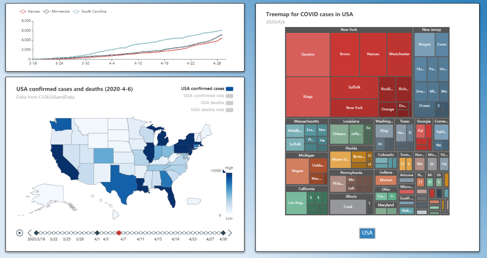
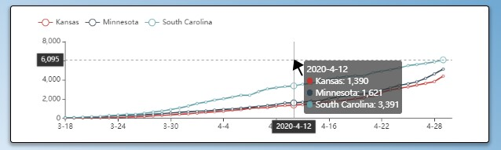
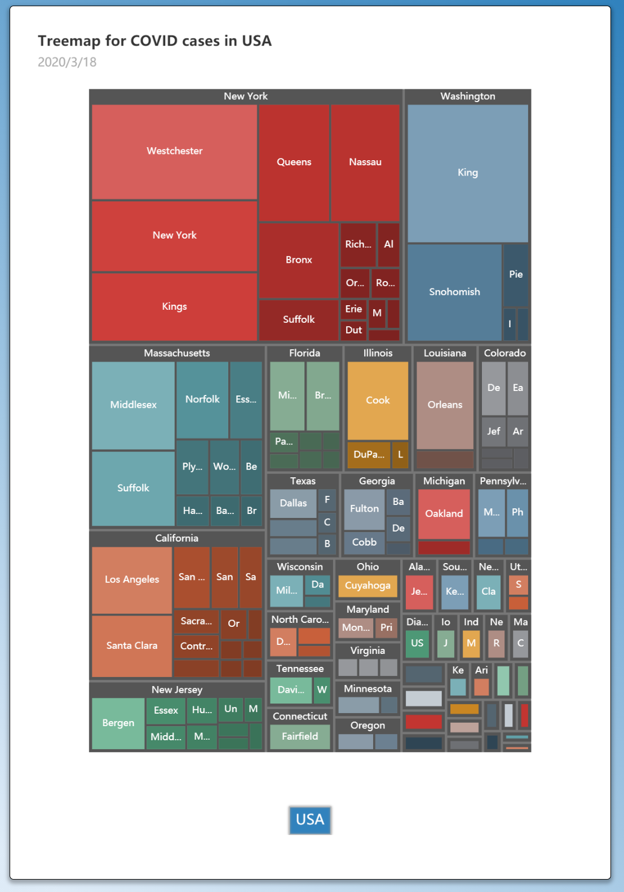
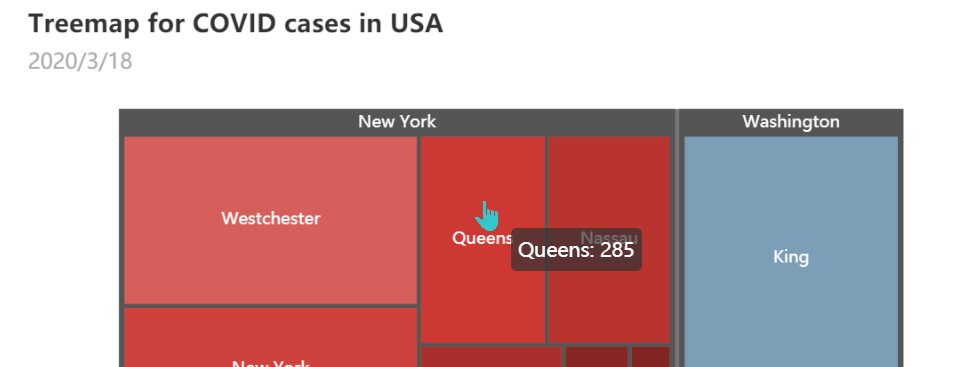
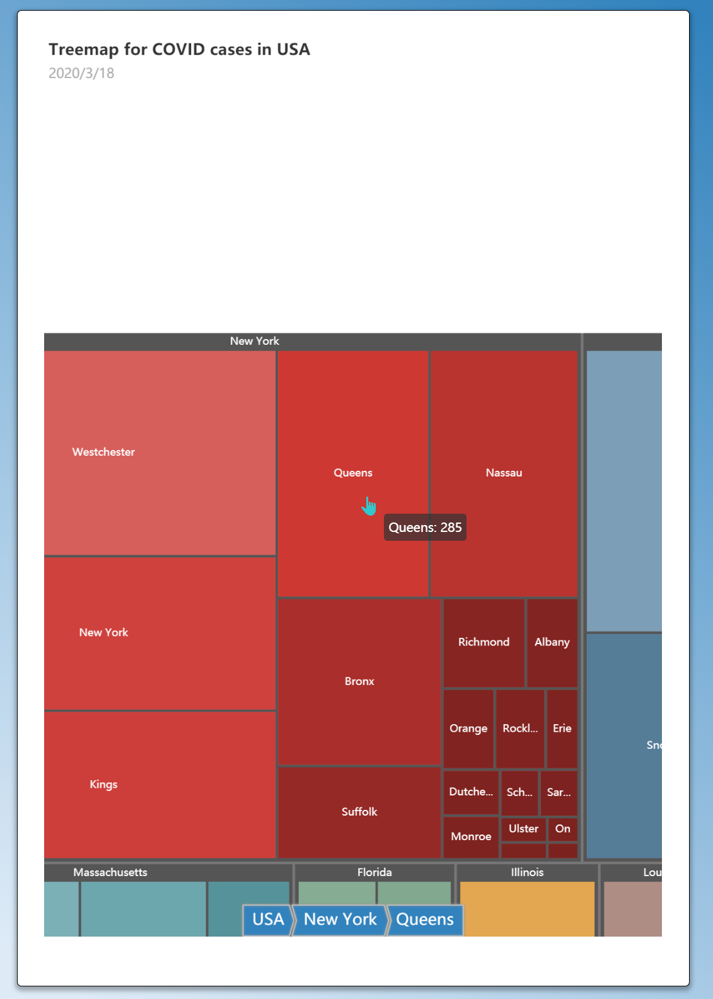
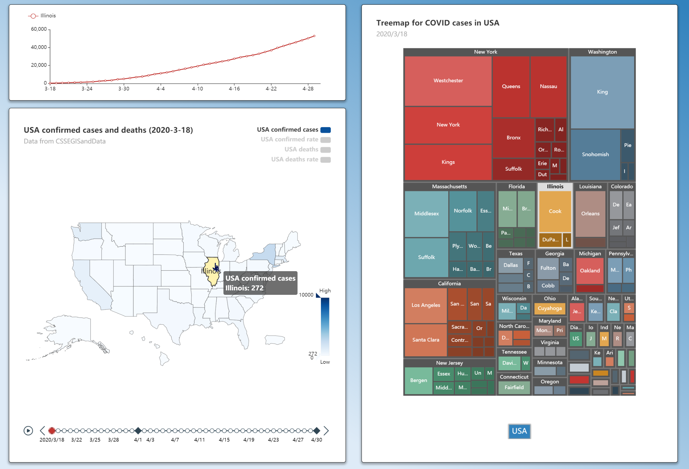

# 美国疫情可视化平台

### 项目背景

2020年，新型冠状病毒席卷美国各地。截止2020.3.17，美国的50个州全部沦陷，最后一块净土西弗吉尼亚州也检测出一例确诊。

在本次可视化项目中，我们小组选取了美国从3月18日到4月30日共44天中，各个州以及具体的县区的确诊和死亡人数数据进行可视化。我们期望能够以此来呈现出病毒在美国的传播规律，找出传染的关键州并预测其五月份的疫情趋势。

### 设计需求

> TODO

- How the did the COVID-19 spread in the United States ?
- The Key state for the spread of the COVID-19 ?
- Comparison between different states?
- Trend of the epidemic

### 设计介绍

#### 整体布局

> 截图整体的试图，简要介绍各个视图显示的内容

#### 子视图介绍 - 地图

##### 视图元素

##### 功能介绍

#### 子视图介绍 - 折线图

折线图用于显示选定州在45天内的总确诊人数（死亡人数、确诊率、死亡率）的变化情况。

##### 视图元素

- legend
- tooltip
- axis pointer

##### 功能介绍

- hover
- click

#### 子视图介绍 - 树图
树图用于展示美国各州及其所辖市/县的确诊人数、死亡人数和总人口数的排序情况

##### 视图元素

- title
  - 标题位置自适应整个图元的高度、宽度
- subtitle
  - 副标题根据Legend切换自动更改成日期或人口数
  - 副标题根据时间轴timeline自动更改显示日期
- treemap
  - 可缩放大小
  - 可整体拖拽调整位置
  - 按颜色区分各州数据，颜色深浅为所辖市/县人数排序
- breadcrumb
  - 面包屑导航位置自适应整个图元的高度、宽度
  - 更改颜色区分确诊人数和死亡人数显示

##### 功能介绍
- hover
  - 鼠标悬浮在州或县/市的图块上方时显示对应名称和人数
  
- click
  - 鼠标点击树图中的某一市/县时，代表该州的方块会移动到整个图元正中，完整显示其下瞎市/县数据，同时面包屑导航按级展示国家-州-市/县信息，点击面包屑导航即可回到相关页面
  
  - 鼠标点击地图中某一州时，该州在树图的对应位置会予以高亮显示
  

#### 视图联动

- 筛选感兴趣的州
- 选择其他种类的数据

##### 

### 案例展示

// 截图 解释

