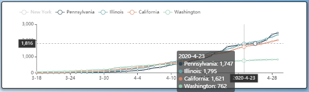

# 美国疫情可视化平台

### 一、项目背景

2020年，新型冠状病毒席卷美国各地。截止2020.3.17，美国的50个州全部沦陷，最后一块净土西弗吉尼亚州也检测出一例确诊。

在本次可视化项目中，我们小组选取了美国从3月18日到4月30日共44天中，各个州以及具体的县区的确诊和死亡人数数据进行可视化。我们希望能够以此来呈现出病毒在美国的传播规律，找出传染的关键州并预测其五月份的疫情趋势。

### 二、设计需求

本次疫情可视化任务，我们选择了美国作为可视化的对象，我们想要探寻的数据规律有以下几点：

- 新冠疫情是如何在美国扩散开的？
- 美国疫情扩散的关键州是是哪个州?
- 不同州之间的疫情变化有何差异？

为了探寻疫情的扩散规律，就必须引入地理信息。我们选择了Geo-Map，它可以很清晰地呈现出各个州的分布，从而也更容易发现疫情传播的地理特性（从严重地区向毗邻区域扩散）。

为了找到疫情扩散的关键州，我们选择用颜色对各州的确诊/死亡人数进行编码。较深的颜色代表该州受新冠感染的人数更多，这样用户将能轻易地从地图中看出重感染区。

为了对比不同州之间的差异，我们选择了折线图。相较于地图而言，通过将时间信息编码到折线图的一轴，我们可以看到一个或多个州在完整的时间线上的变化情况，并推测其未来的趋势。通过将不同州的信息同时呈现在一张图上，我们能清楚地看出不同州之间疫情变化的差异。

我们选择的数据集是由约翰霍普金斯大学提供的美国各州、市/县的每日确诊、死亡人数。由于数据涉及到了州的下级-市/县，我们决定选用矩形树图来呈现具体到市/县的疫情数据。

此外，各个视图之间不应该是完全独立的，我们希望为视图间增加交互功能，达到各可视化图表之间的联动，使用户能够更加自由地筛选自己感兴趣的数据、挖掘感兴趣的数据规律。

### 三、设计介绍

#### 3.1 整体布局

我们的界面包含三个可视化视图：

- 主视图：直观的**地理视图**，呈现出每天每个州的情况，由该视图发出总的交互请求。
- 辅助视图：**折线图**，呈现各州疫情在一个完整时间线上的变化，同时反映各个州疫情走势的不同。
- 辅助视图：**矩形树图**，用于表征美国的整体情况、各个州下设的县的情况

#### 3.2 主视图介绍 - 地图

地理地图（英文：geo map）是一种二维的空间信息可视化形式，其包含了经、纬度的位置信息、名称信息以及可扩展的数据信息。本实验中的地图以省（州）为单位，每个图元包含了名称信息以及与时间绑定的确诊人数、死亡人数、确诊人数占比和死亡人数占比。

##### 3.2.1 视图元素

1. 图表标题 (Title)
   - 标题位置自适应整个图元的高度、宽度
   - 标题根据Legend切换自动更改
   - 标题根据时间轴timeline自动更改显示日期
2. 副标题 (Subtitle)
   - 副标题位置自适应主标题位置
3. 主地图 (Map)
   - 可缩放大小
   - 可整体拖拽调整位置
   - 颜色根据数据值（确诊人数/死亡人数/确诊人数比率/死亡人数比率）自动调节深浅
4. 图例 (Legend)
   - 图例位置自适应整个图元的高度、宽度
   - 图例设置为单选模式，每次只能选择一种数据进行展示（确诊人数/死亡人数/确诊人数比率/死亡人数比率）
5. 视觉映射颜色条 (VisualMap-colorbar)
   - 进行视觉编码，将Map中的数据映射到颜色深度上（视觉通道）
   - 根据确诊/死亡两大类自适应调整映射的颜色（蓝色系/红色系）
   - 位置自适应整个图元的高度、宽度
   - 自适应显示映射数据的单位（`个` / `‰` / `‱`），最大值与最小值
6. 时间轴 (Timeline)
   - 特殊日期用特殊的symbol标注（起始点、终点、四月初）
   - 为防止日期的text过多，每隔三天显示一次日期，同时显示出特殊日期

##### 3.2.2 功能介绍 - hover

下面介绍不同元素对hover事件的响应：

- Map

  用户能够将鼠标悬浮在地图中的某一个州上，触发三个action：

  1. Map中该州区域被高亮（采用相反色系进行强调）
  2. Map中该州附近将显示一个tooltip展示其细节信息，位置跟随鼠标位置，显示信息包括：当前显示数据的类型（确诊人数/死亡人数/确诊人数比率/死亡人数比率）, 数据值（为了显示的美观，数据每隔三位数增设一个逗号，若为比率数据，则统一显示三位小数）
  3. 在VisualMap-colorbar上显示出一个浮动游标，标记出其具体数值以及在整个colorbar中的位置。
  
    

- 视觉映射颜色条 (VisualMap-colorbar)

  用户能够将鼠标悬浮在colorbar中，触发两个action：

  1. 在VisualMap-colorbar上显示出一个浮动游标，标记出鼠标所悬浮位置的估计数值。
  2. Map中与所选值接近的州区域（可以是一个，也可以是多个）被高亮（采用相反色系进行强调）

  

- 时间轴 (TimeLine)

  用户能够将鼠标悬浮在timeline的各个圆点上，将会显示提示框和提示信息，提示信息包括：具体的日期，该日期的备注（特殊日期才有），如下图所示：

  

  

##### 3.2.3 功能介绍 - 拖拽

下面介绍不同元素对拖拽事件的响应：

- 视觉映射颜色条 (VisualMap-colorbar)

  用户能够在colorbar上选择感兴趣的数值区间，首先改变映射的数值区间，然后可以进行拖拽。此时左侧的Map仅对选中的数值区间内的州进行视觉编码（上色）如下图所示：

  

##### 3.2.4 功能介绍 - click

下面介绍不同元素对click事件的响应：

- 图例 (legend) 

  用户能够通过点击legend切换显示的数据，进行切换后Map的颜色色系会相应改变，同时VisualMap-Colorbar的颜色以及单位、最大值最小值也会相应改变。总共有四种mode可以选择，且设置为单选。四种模式下的界面如下图所示：  

- 时间轴 (Timeline)
  - 用户能够通过点击Timeline上的不同时间点，切换当前显示的数据。具体效果见演示视频。
  - 用户能够通过点击Timeline左侧的播放/暂停键，开启/停止数据的播放功能。开启后Map中的数据将会随时间变化，时间间隔为1s一调转。具体效果见演示视频。

#### 3.3 子视图介绍 - 折线图

折线图用于显示选定州在45天内的总确诊人数（死亡人数、确诊率、死亡率）的变化情况。在折线图中，我们可以看到完整的时间线，也可以对比不同州之间疫情形势的差异。

##### 3.3.1 视图元素

- 图例 (legend)

  - 图例位置自适应整个图元的高度、宽度
  - 图例设置为多选模式，可以选择需要展示的州

- tooltip

  悬浮窗跟随鼠标移动，在窗口中显示：

  - 鼠标悬浮点对应日期
  - 当前所选各州的名字
  - 当前所选各州的具体确诊/死亡人数

- axis pointer

  - 显示鼠标悬浮点对应的x、y轴坐标，分别对应人数和时间
  - 显示两轴相应的垂直线
  - 突出显示折线数据中与两条指示线相交的数据点

##### 3.3.2 功能介绍 - hover

- legend

  鼠标悬停在legend上，对应州的数据线将会突出显示。

  

- line chart

  鼠标悬停在图表中的任意一点，将会显示：

  - 悬浮窗显示对应日期各州的确诊/死亡人数
  - 向两轴作垂线指示悬浮点的坐标：(日期，人数)

  

##### 3.3.3 功能介绍 - click

- legend

  点击legend，对应州的数据会暂时不予显示。y轴的范围自适应改变。再次点击后，数据将重新显示。

  

  

#### 3.4 子视图介绍 - 树图

树图 (treemap) 用于展示美国各州及其所辖市/县的确诊人数、死亡人数和总人口数的排序情况。

##### 3.4.1 视图元素

- title
  - 标题位置自适应整个图元的高度、宽度
- subtitle
  - 副标题根据Legend切换自动更改成日期或人口数
  - 副标题根据时间轴timeline自动更改显示日期
- treemap
  - 可缩放大小
  - 可整体拖拽调整位置
  - 按颜色区分各州数据，颜色深浅为所辖市/县人数排序
- breadcrumb
  - 面包屑导航位置自适应整个图元的高度、宽度
  - 更改颜色区分确诊人数和死亡人数显示

##### 3.4.2 功能介绍 - hover

- 鼠标悬浮在州或县/市的图块上方时显示对应名称和人数

  

##### 3.4.3 功能介绍 - click

- 鼠标点击树图中的某一市/县时，代表该州的方块会移动到整个图元正中，完整显示其下瞎市/县数据，同时面包屑导航按级展示国家-州-市/县信息，点击面包屑导航即可回到相关页面

  

- 鼠标点击地图中某一州时，该州在树图的对应位置会予以高亮显示

  

#### 3.5 视图间联动

视图间通过共享数据来实现联动，这部分的效果可参考录制的视频。

##### 3.5.1 在Map中点击某州

- 通过在地图中点击一个州，可以将该州加入折线图显示区域。
- 折线图中显示的州的数量不受限制。

##### 3.5.2 在Map中选择数据种类

在地图中可以选择显示的数据种类：确诊总人数、死亡总人数、确诊率、死亡率。此时，其他两个视图的联动效果如下：

- 折线图的y轴将调整为显示对应数据。
- treemap
  - 当选择的数据为人数类时，treemap将显示对应数据mode；
  - 当选择的数据为比率类时，treemap将显示各州县的人数，以供对比参考。

##### 3.5.3 在Map中改变时间

- 在地图的时间轴上点选某个确定的时间，则treemap所显示数据的对应日期也会发生改变。
- 点击播放地图的时间轴，则treemap也会对应进行播放。

### 四、案例展示

下面我们将具体演示该美国疫情可视化工具的使用方法。

1. 我们先查看3月22日，疫情刚刚扩散时的情况。从地图和树图中都可以明显地看出，此时纽约州疫情遥遥领先其他各州，确诊人数在15000人以上。

   

   

2. 将时间移到4月1日。通过地图视图中visual map的hover操作，我们可以看到，确诊人数大于9000的州已经达到五个。其中一个是西海岸的加州，其余四个聚集在东北部，与纽约州很近。

   

   

3. 时间移到4月23日，筛选死亡人数大于400的州，可以看到疫情已经向中部蔓延。

   

   

4. 从树图中，可以看到纽约州仍是遥遥领先。并且，通过树图的二级结构，我们能发现，连纽约州的单个市/县，其确诊人数已经超过了大部分州。

   

   

5. 通过折线图我们可以看到，除最严重的纽约州，其他较严重的各州的疫情走势大体相同。

   

   

   

   

   

   

